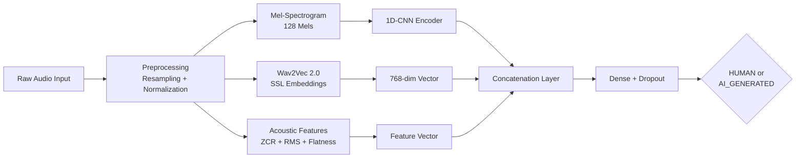

<div align="center">

# 🎙️ Audio Call Analyser — Multilingual Voice Deepfake Detector

**Real-time AI-powered voice authenticity verification using a fusion deep learning architecture**

[](https://github.com/coolss21/audio_call_analyser/actions)
[](https://python.org)
[](https://flask.palletsprojects.com/)
[](https://pytorch.org/)
[](LICENSE)
[](#-docker-setup)

</div>

---

## 📌 Problem Statement

With the rise of AI-generated voice clones and deepfake audio, phone scams are becoming increasingly sophisticated. Traditional fraud detection systems fail to distinguish between genuine human voices and synthetic speech. **Audio Call Analyser** addresses this by providing a production-ready API that classifies audio as `HUMAN` or `AI_GENERATED` with high confidence across multiple languages.

---

## 🧠 Model Architecture

The system uses a **Multi-Path Fusion Architecture** that combines three complementary feature extraction pipelines for robust detection:



| Pipeline | Technique | Output |
|----------|-----------|--------|
| **Time-Frequency** | Mel-spectrogram (128 mels) | Frequency-domain patterns |
| **Self-Supervised** | `facebook/wav2vec2-base` embeddings | 768-dim contextual representations |
| **Acoustic** | ZCR, RMS Energy, Spectral Flatness | Low-level signal characteristics |

---

## ✨ Key Features

- 🌐 **Multilingual Support** — English, Hindi, Tamil, Telugu, Malayalam
- 🧬 **Fusion Model** — Combines spectral, SSL, and acoustic pipelines for higher accuracy
- ⚡ **CPU-Optimized** — No GPU required; runs on free-tier cloud instances
- 🐳 **Docker Ready** — One-command deployment with containerization
- 🔌 **REST API** — Simple JSON-based request/response for easy integration
- 🔒 **API Key Auth** — Built-in `x-api-key` header authentication

---

## 🚀 Quick Start

### Local Setup

```bash
# 1. Clone the repository
git clone https://github.com/coolss21/audio_call_analyser.git
cd audio_call_analyser

# 2. Create virtual environment
python -m venv venv
source venv/bin/activate  # Windows: venv\Scripts\activate

# 3. Install dependencies
pip install -r requirements.txt

# 4. Start the API server
python app.py
# Server starts at http://localhost:5000
```

### 🐳 Docker Setup

```bash
docker build -t audio-call-analyser .
docker run -p 5000:5000 audio-call-analyser
```

---

## 🔌 API Reference

### `POST /detect` or `POST /api/voice-detection`

**Headers:**
```
Content-Type: application/json
x-api-key: secret123
```

**Request:**
```json
{
  "language": "English",
  "audioFormat": "mp3",
  "audioBase64": "<base64_encoded_audio>"
}
```

**Response:**
```json
{
  "status": "success",
  "classification": "HUMAN",
  "confidenceScore": 0.8524
}
```

### `GET /health`

Returns API health status and model readiness.

---

## 📂 Project Structure

```
audio_call_analyser/
├── app.py                          # Flask REST API server
├── deepfake_detector.py            # Core fusion model & inference logic
├── deepfake_model_multilingual.pt  # Pre-trained model weights
├── src/
│   ├── config.py                   # Model & API configuration
│   ├── detector.py                 # Detection pipeline orchestrator
│   ├── models/                     # Model architecture definitions
│   └── processors/                 # Audio preprocessing utilities
├── requirements.txt                # Python dependencies
├── Dockerfile                      # Container configuration
├── .github/workflows/ci.yml       # Automated CI pipeline
└── LICENSE                         # MIT License
```

---

## 🧪 Testing

```bash
# Run syntax & import validation
python -m py_compile app.py
python -m py_compile deepfake_detector.py

# Run the test client (if available)
python test_api.py
```

---

## 🛡️ Security Considerations

- API key authentication via `x-api-key` header
- Audio data processed in-memory (no disk persistence)
- Base64 input validation to prevent injection attacks
- Rate limiting recommended for production deployments

---

## 📄 License

This project is licensed under the [MIT License](LICENSE).

<div align="center">
  <br/>
  <p><i>Built for the AI Voice Detection Hackathon — Defending authenticity in the age of synthetic media.</i></p>
</div>
